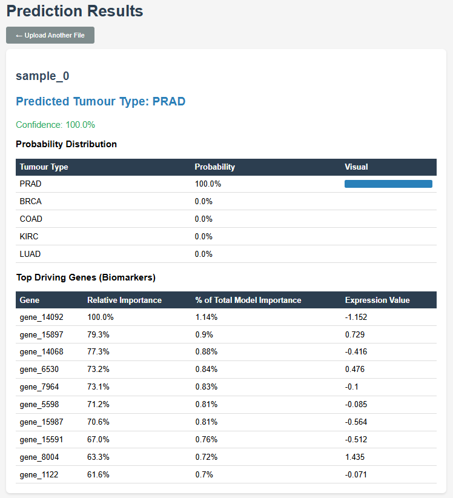

# Pan-Cancer Transcriptomic Subtyping Classifier

A supervised machine learning pipeline that classifies primary tumour origin from RNA-Seq gene expression data, deployed as a Flask web application.

Built as part of the GTAC Python for Bioinformatics capstone.

## Data

Download from the [UCI ML Repository](https://archive.ics.uci.edu/dataset/401/gene+expression+cancer+rna+seq) and place `data.csv` and `labels.csv` in the `data/` directory.

---

## Overview

Given a patient's normalised gene expression profile across 20,531 genes, the pipeline predicts which of five tumour types the sample originates from and identifies the top biomarker genes driving that prediction.

The primary clinical application is **Cancer of Unknown Primary (CUP)** — where conventional diagnosis cannot determine where a metastatic tumour originated. Gene expression profiling can help because tumour cells retain the transcriptomic signature of their tissue of origin even after metastasis.

**Dataset:** TCGA Pan-Cancer cohort (UCI ML Repository) — 801 patients, 20,531 genes, 5 tumour types (BRCA, KIRC, LUAD, PRAD, COAD).

---

## Results

| Metric | Score |
|--------|-------|
| Test Accuracy | 96.3% |
| Macro F1 | 0.9577 |
| Micro F1 | 0.9627 |
| Misclassified | 6/161 patients |

All 6 misclassifications involved LUAD — consistent with its transcriptomic overlap with other adenocarcinomas visible in the PCA scatter plot.

---

## Pipeline

```
data_loader.py   — load and validate gene expression matrix and labels
preprocessor.py  — StandardScaler + PCA (160 components, 80% variance)
trainer.py       — Random Forest vs MLP baseline, GridSearchCV, k-fold CV
evaluator.py     — confusion matrix, macro/micro F1, misclassification log
explainer.py     — Random Forest feature importances, biomarker extraction
app.py           — Flask deployment with CSV upload and prediction output
```

---

## Key Decisions

| Decision | Choice | Rationale |
|----------|--------|-----------|
| Dimensionality reduction | PCA, n=160 | 80% variance retained, confirmed by scree plot |
| Primary model | MLP (100, 50) | Macro F1 0.9724 vs RF 0.9633, lower std across folds |
| Evaluation metric | Macro F1 | Equal weight to all classes despite BRCA imbalance (37%) |
| Explainability | Random Forest importances | MLP trained on PCA components — separate explainer needed for gene-level interpretability |
| Data leakage prevention | Fit scaler/PCA on train only | Test set statistics never influence training |

---

## Demo



---

## Installation

```bash
conda create -n tcga_classifier python=3.11
conda activate tcga_classifier
pip install -e .
```

## Usage

```bash
# Train pipeline
python main.py

# Start web app
python src/tcga_classifier/app.py
```

Visit `http://localhost:5001` — upload a CSV of patient RNA-Seq profiles to receive tumour type predictions, confidence scores, and top driving biomarker genes.

---

## Limitations

- 801 samples is small for a clinical-grade tool — production would require independent cohort validation
- Gene IDs are anonymous (`gene_0`, `gene_1`) — a real pipeline would map to HUGO gene symbols
- Clinical deployment would require UKCA marking and regulatory approval
